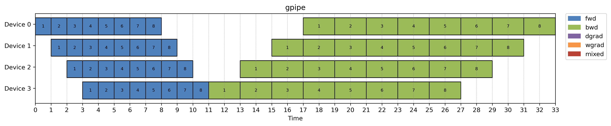
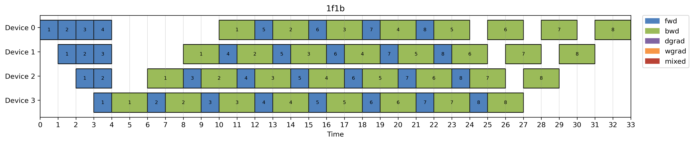
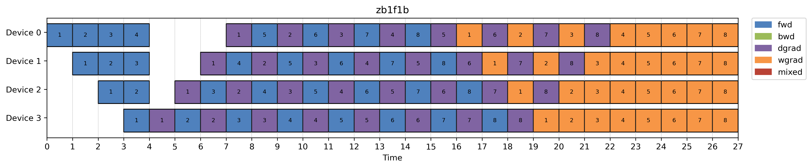
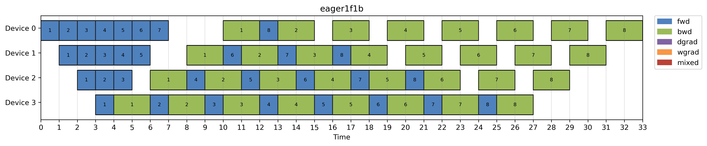
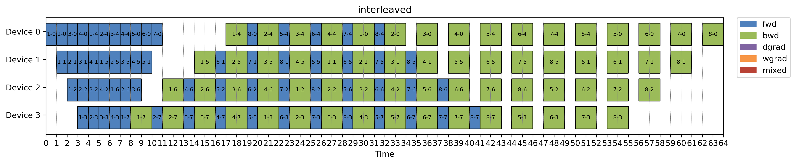
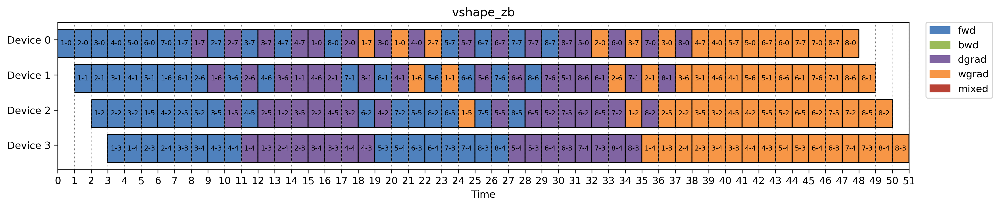
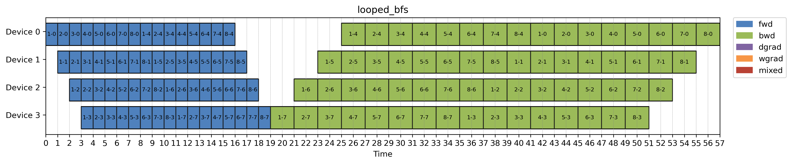
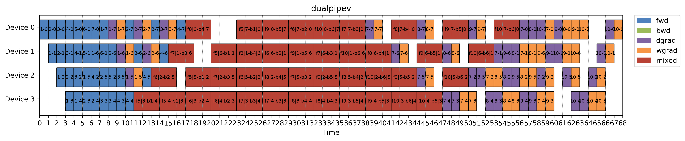

# Pipeline Parallelism for Minimalists

Every paper seems to present pipeline schedules in a slightly different setup, which makes it hard to compare them side by side. So I went down the rabbit hole and built a tiny simulator to explore them in a unified way.

It’s a lightweight, CPU-only tool that lets you:

- Mix and match partitioning, assignment, and execution strategies
- Simulate microbatch flows step by step
- Visualize all schedules in a consistent timeline format

The whole thing is under 1,000 lines of code—not production-ready, a bit rough around the edges—but it helped me understand and compare schedules much more clearly.

📝 Check out the full blog post here:
https://ailzhang.github.io/posts/pipeline-parallelism-demystified/

## Supported schedules

- gpipe

- 1f1b

- zero bubble 1f1b

- eager 1f1b

- interleaved virtual pipeline

- vshape zero bubble

- bfs looping

- dualpipev

## Bug reports

This repo started as a toy side project without thorough and there will definitely be rough edges. PRs and bug reports are welcome! 
